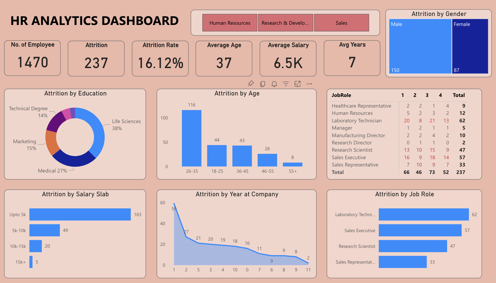

# HR Analytics Dashboard

## Project Objective

The purpose of this project is to help an organization to improve employee performance and reduce attrition by creating an HR analytics dashboard. The dashboard provides valuable insights into employee data, which can be used to make data-driven decisions and improve employee satisfaction and retention.

### Dataset
**Data Source:**
The raw data for this project was obtained in the form of a CSV file with 38 columns and approximately 1.5k rows. The data contained information about employee demographics, job roles, salaries, and tenure, among others.

[Raw Dataset](HR_Analytics_Dataset.csv)

### Data Cleaning and Processing:
Several steps were taken to prepare the data for analysis. Null values were removed and duplicate values were eliminated. Spelling errors were identified and corrected, and appropriate data types were assigned. Additionally, a conditional column was added for attrition count, which assigned a value of 1 for 'yes' and 0 for 'no' based on the attrition column. Furthermore, a new measure was created to calculate the attrition rate, which was derived by dividing the total attrition count by the total employee count.

### Key Performance Indicators (KPIs):
To start the analysis, I have identified the key performance indicators (KPIs) to track and monitor employee performance and attrition. The following KPIs were created with card visualizations in Power BI:

1. Employee count
2. Attrition 
3. Attrition rate
4. Average age
5. Average income
6. Average tenure

## Dashboard

### Charts and Insights:

I have used several charts and visualizations to gain insights into the employee data. Here are some of the key insights gained from the analysis:

1. Tree map chart: The chart showed the distribution of attrition by gender. The data showed that 140 males and 79 females had left the company, indicating that male employees were leaving the company more than female employees.

2. Pie chart: The chart displayed the attrition count by education field. The data showed that the attrition count was highest in the Life Sciences field, with 38% of employees leaving, followed by the Medical Field, with 27% of employees leaving.

3. Stacked column chart: The chart showed the attrition count by age group. The data revealed that the age group from 26-35 had the highest attrition count of 116.

4. Matrix table: The table displayed job roles by job satisfaction scores, highlighting the big numbers in red. The data showed that laboratory technicians had the highest attrition count, followed by sales executives and research scientists.

5. Funnel chart: The chart displayed the attrition count by monthly salary slabs. The data showed that the attrition count was highest in the salary slab up to 5K, which was less than the average income in the company, which was 6.5k.

6. Area chart: The chart displayed the attrition count by years in the company. The data showed that the highest peak was after completing the first year in the company, followed by completing 10 years, and then completing 5 years.

7. Stacked bar chart: The chart showed the top 3 job roles with the highest attrition count. The data showed that laboratory technicians had the highest attrition count of 62, followed by sales executives and research scientists.

### Filters:
Finally, department filters were implemented at the top of the dashboard, which allowed users to filter the entire dashboard by selecting a specific department.

Some suggestions for the HR department to improve employee performance and retention:

1. Investigate the reasons behind the higher attrition rate among male employees and take appropriate measures to address their concerns and needs.

2. Identify the root causes of the high attrition rate among employees in the Life Sciences and Medical Fields and take necessary steps to retain employees in these areas.

3. Address the concerns of employees in the age group of 26-35, who have the highest attrition rate, and provide them with better opportunities for career growth and development.

4. Conduct a review of the job roles with the highest attrition rate, such as Laboratory Technicians, Sales Executives, and Research Scientists, to identify the reasons behind the high attrition rate and take necessary steps to address these concerns.

5. Review the salary structure of the company, especially for employees in the salary slab of up to 5K, and consider adjusting the salaries to make them more competitive in the market.

6. Provide training and development opportunities for employees to help them enhance their skills and progress in their careers, which can improve job satisfaction and reduce attrition.

7. Provide employees with a supportive work environment, opportunities for work-life balance, and recognition and rewards for their contributions to the company, which can increase employee engagement and retention. 

## Conclusion
This HR analytics dashboard showed important information about employees that can help make better decisions and keep employees happy and working for the organization. By taking actions to address the issues that employees face and creating a positive work environment, the HR department can help employees perform better and stay in their jobs longer. This can help the organization make more money and be more successful.
